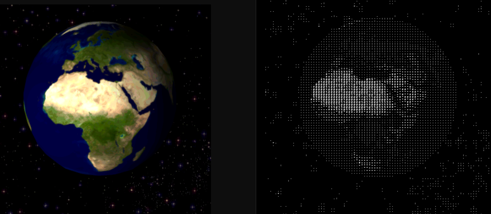

# ASCII Art GIF Converter

Convert GIFs to ASCII art with interactive zoom and export options.

## What It Does
- Transform animated GIFs into text-based art. Zoom, pan, and export in multiple formats including GIF, ASCII, JSON, and CSV.

## How to Use
Enter a GIF URL, click to zoom, scroll to adjust, drag to pan. Export the result in your preferred format.

## Tech
Vanilla JavaScript
p5.js
GSAP
gif.js

  
  
  

Goat count:
[https://ascii.goatcounter.com/](https://ascii.goatcounter.com/)
